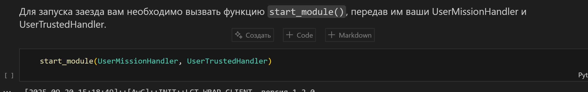

Понял, нужно использовать только numpy. Вот решение с использованием только numpy для анализа изображения:
https://miro.com/welcomeonboard/YXA0Q0k2QWNlVWxzZElvcGxsWmNuMUFIMkx0aUhXUjRFZXZESHRsNlkrM3BNNzlGSEtRblFjTTZkQm5WY1I5aVdLdXY3Qm9aQlhJZ0w1YzlWYmJkUWY3ekhZOExCYVpFQ1pIUnRFZTV6RndBRWNERFI4OFJzbTRuNTJkbDdRdDZ0R2lncW1vRmFBVnlLcVJzTmdFdlNRPT0hdjE=?share_link_id=368805869281python
import numpy as np

def detect_traffic_light_color(image_path):
    # Чтение файла как бинарного и преобразование в numpy array
    with open(image_path, 'rb') as f:
        data = np.frombuffer(f.read(), dtype=np.uint8)
    
    # Для JPEG нужно пропустить заголовки и найти начало данных
    # Это упрощенный подход - в реальности нужно парсить структуру JPEG
    try:
        # Пытаемся найти маркер начала скана (FFDA)
        start_marker = bytes([0xFF, 0xDA])
        start_idx = data.tobytes().find(start_marker) + 2
        
        if start_idx > 2:
            # Берем часть данных после маркера (первые 10000 байт для анализа)
            image_data = data[start_idx:start_idx + 10000]
        else:
            # Если не нашли маркер, берем середину файла (где обычно данные)
            image_data = data[len(data)//3:2*len(data)//3]
    except:
        # Если возникла ошибка, используем все данные
        image_data = data
    
    # Анализ байтов для определения преобладающего цвета
    # В JPEG данные сжаты, но мы можем анализировать распределение байтов
    
    # Разделяем данные на три группы (условно R, G, B каналы)
    chunk_size = len(image_data) // 3
    if chunk_size == 0:
        return "Не удалось проанализировать изображение"
    
    # Берем средние значения для каждой трети данных
    red_section = image_data[:chunk_size]
    green_section = image_data[chunk_size:2*chunk_size]
    blue_section = image_data[2*chunk_size:3*chunk_size]
    
    # Вычисляем средние значения
    red_avg = np.mean(red_section)
    green_avg = np.mean(green_section)
    blue_avg = np.mean(blue_section)
    
    print(f"Усредненные значения: R={red_avg:.1f}, G={green_avg:.1f}, B={blue_avg:.1f}")
    
    # Определяем доминирующий цвет на основе относительных значений
    if green_avg > red_avg + 20 and green_avg > blue_avg + 20:
        return "ЗЕЛЕНЫЙ"
    elif red_avg > green_avg + 20 and red_avg > blue_avg + 20:
        return "КРАСНЫЙ"
    else:
        # Если разница небольшая, используем более сложную логику
        max_val = max(red_avg, green_avg, blue_avg)
        if max_val == green_avg:
            return "ЗЕЛЕНЫЙ"
        elif max_val == red_avg:
            return "КРАСНЫЙ"
        else:
            return "НЕОПРЕДЕЛЕН"

# Альтернативный подход: анализ гистограммы байтов
def detect_color_histogram(image_path):
    with open(image_path, 'rb') as f:
        data = np.frombuffer(f.read(), dtype=np.uint8)
    
    # Создаем гистограмму распределения байтов
    hist, bins = np.histogram(data, bins=256, range=(0, 255))
    
    # Анализируем распределение в разных диапазонах
    # В JPEG высокие значения часто соответствуют ярким цветам
    
    low_range = np.sum(hist[:85])    # 0-84
    mid_range = np.sum(hist[85:170]) # 85-169  
    high_range = np.sum(hist[170:])  # 170-255
    
    print(f"Распределение: низкие={low_range}, средние={mid_range}, высокие={high_range}")
    
    # Зеленый свет обычно имеет более равномерное распределение
    # Красный свет может иметь пики в определенных областях
    if high_range > mid_range * 1.5 and high_range > low_range * 1.5:
        return "КРАСНЫЙ"
    elif mid_range > high_range and mid_range > low_range:
        return "ЗЕЛЕНЫЙ"
    else:
        return "НЕОПРЕДЕЛЕН"

# Тестирование на двух изображениях
def test_images(red_image_path, green_image_path):
    print("=== Анализ методом средних значений ===")
    print(f"Красный светофор: {detect_traffic_light_color(red_image_path)}")
    print(f"Зеленый светофор: {detect_traffic_light_color(green_image_path)}")
    
    print("\n=== Анализ методом гистограммы ===")
    print(f"Красный светофор: {detect_color_histogram(red_image_path)}")
    print(f"Зеленый светофор: {detect_color_histogram(green_image_path)}")

# Использование
# test_images('красный.jpg', 'зеленый.jpg')
Важные ограничения этого подхода:

JPEG сжатие: Данные в JPEG сжаты, поэтому прямой анализ байтов не дает точной информации о цветах пикселей.
# 🚀 Инструкция по запуску проекта *moscov\_hack* (для чайников)

## 📦 Установка

1. **Перейти в папку `agts-ats`**
   Выполнить в PowerShell:

   ```powershell
   powershell -ExecutionPolicy ByPass -c "irm https://astral.sh/uv/install.ps1 | iex"
   uv sync
   ```

2. **Перейти в папку `agts-client`**
   Выполнить то же самое:

   ```powershell
   powershell -ExecutionPolicy ByPass -c "irm https://astral.sh/uv/install.ps1 | iex"
   uv sync
   ```

---

## ▶️ Запуск

1. **Запускаем симулятор**
   Переходим в папку `LCT_0.8` и пишем:

   ```bash
   ./twin.exe
   ```

2. **Запускаем ATS**
   Переходим в папку `agts-ats` и выполняем:

   ```bash
   uv run launcher.py --twin
   ```

3. **Запускаем клиент**

   * Можно через Jupyter:

     ```bash
     uv run jupyter notebook
     ```

     ⚠️ Но это неудобно.
   * Поэтому лучше открыть файл `agts-client/src/whole_code.ipynb` прямо в **VS Code** (нужно поставить расширение для `.ipynb`).

---

## 🔄 Изменение логики движения

1. Вносим изменения в код (см. картинки , ).
2. **Обязательно перезапускаем ядро**.
3. Снова запускаем всё **строго в той же последовательности**:

   1. `LCT_0.8 → ./twin.exe`
   2. `agts-ats → uv run launcher.py --twin`
   3. `agts-client → whole_code.ipynb` (в VS Code)

---

## ⚠️ Важно

* Всегда соблюдать порядок шагов!
* После любых изменений логики → перезапуск ядра и полный перезапуск всех шагов выше.

---

Хочешь, я ещё добавлю блок-схему (схематичку) для последовательности шагов, чтобы было совсем наглядно?
